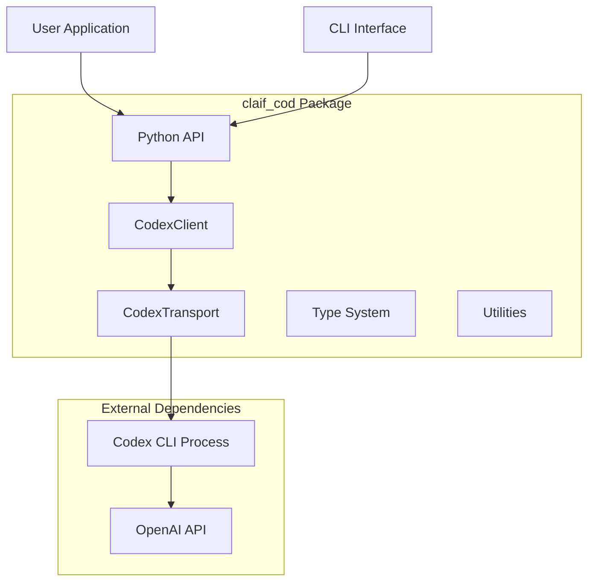
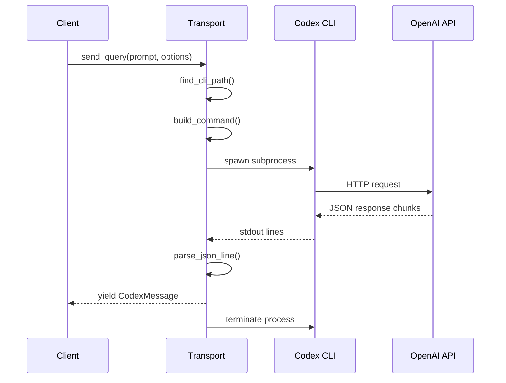
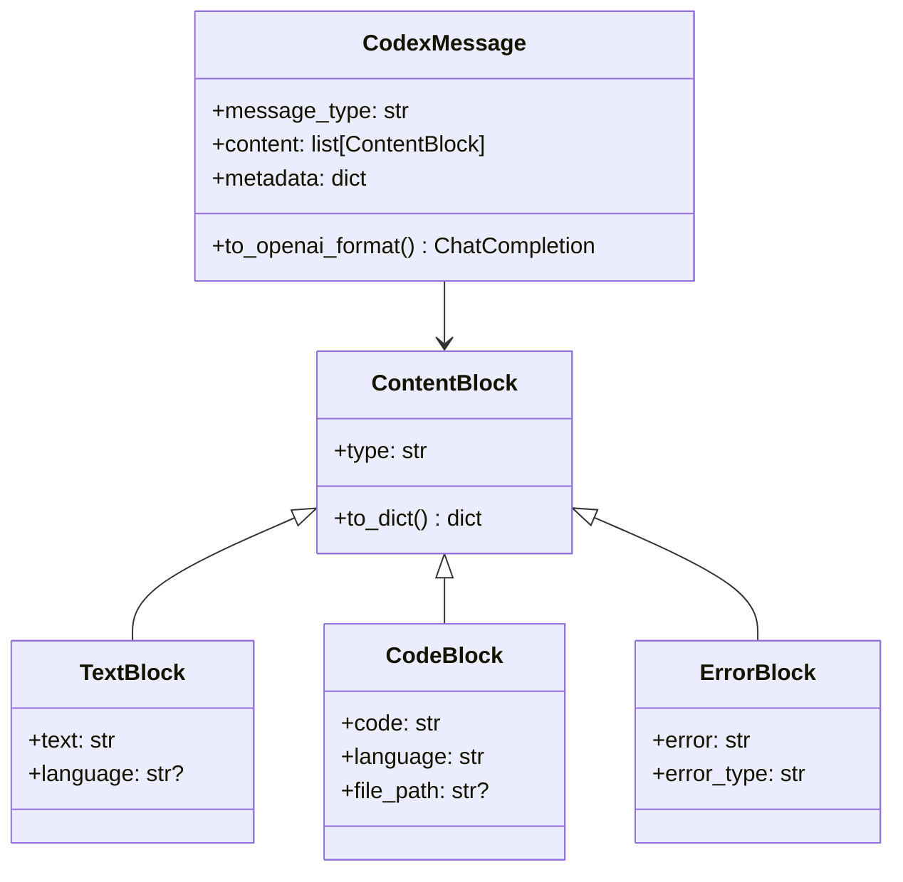
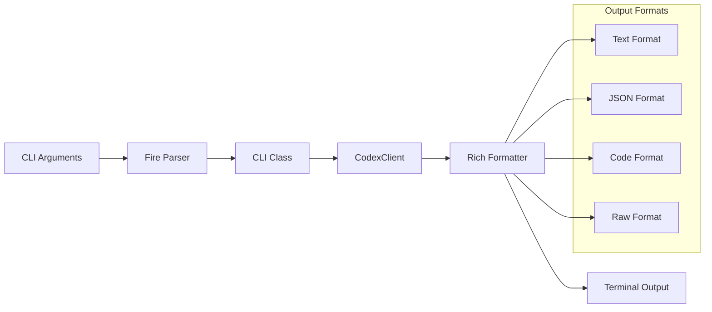
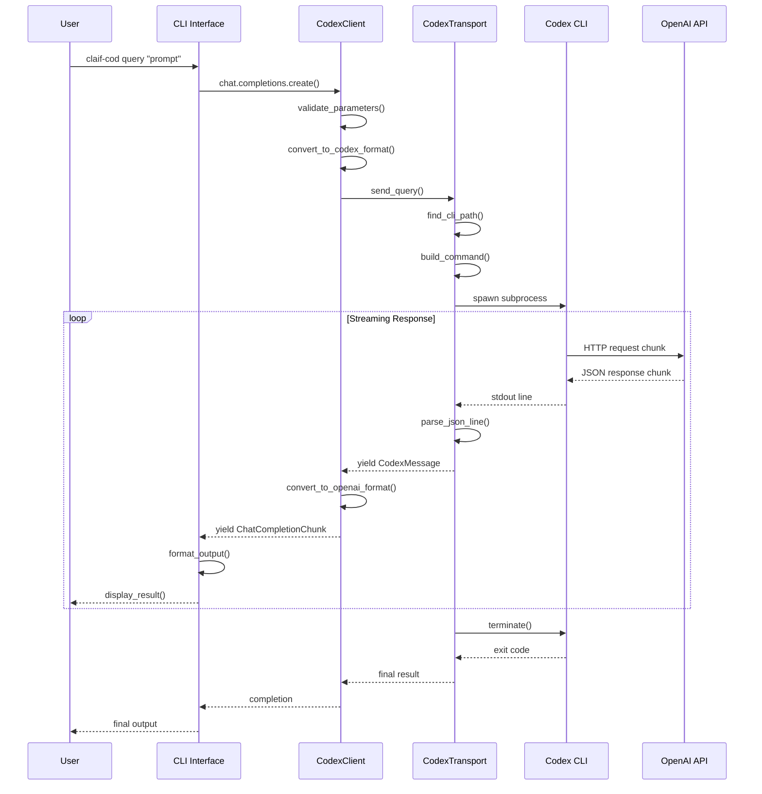
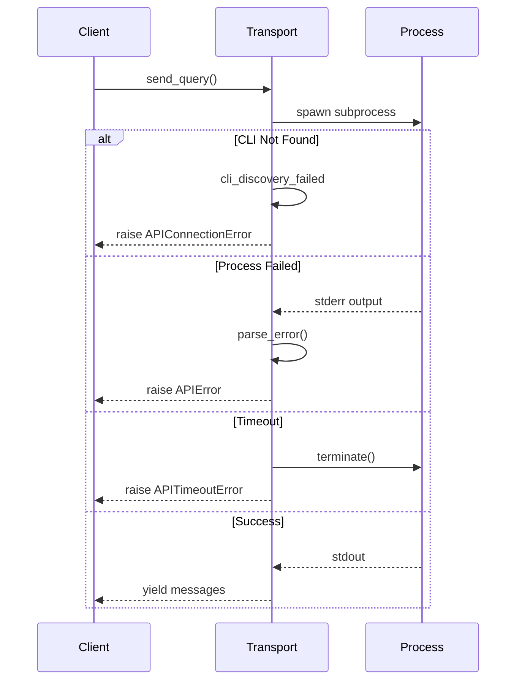

# Architecture

Deep dive into the technical architecture and design decisions behind `claif_cod`.

## System Overview



## Core Components

### 1. Client Layer (`client.py`)

The orchestration layer that manages the lifecycle and provides the OpenAI-compatible interface.

```python
class CodexClient:
    """Main client implementing OpenAI chat completions API."""
    
    def __init__(self, **kwargs):
        self.transport = None  # Lazy initialization
        self.config = self._build_config(kwargs)
    
    def chat.completions.create(self, **kwargs):
        """OpenAI-compatible completion method."""
        # 1. Validate parameters
        # 2. Initialize transport if needed
        # 3. Convert OpenAI format to Codex format
        # 4. Execute via transport
        # 5. Convert response back to OpenAI format
```

**Key Responsibilities:**
- OpenAI API compatibility
- Parameter validation and conversion
- Transport lifecycle management
- Response format translation
- Error handling and retries

**Design Decisions:**
- **Lazy transport initialization**: Transport is only created when needed
- **Stateless design**: Each request is independent
- **Format abstraction**: Hides Codex CLI details from users

### 2. Transport Layer (`transport.py`)

Handles all subprocess communication with the Codex CLI.

```python
class CodexTransport:
    """Manages subprocess communication with Codex CLI."""
    
    async def send_query(self, prompt: str, options: CodexOptions):
        # 1. Discover CLI path
        # 2. Build command arguments
        # 3. Start subprocess with anyio
        # 4. Stream stdout line by line
        # 5. Parse JSON responses
        # 6. Yield messages as they arrive
        # 7. Handle errors and timeouts
```

**Architecture Details:**



**Key Features:**
- **Async subprocess management** with anyio
- **Line-by-line JSON parsing** for streaming
- **Timeout protection** with graceful shutdown
- **Platform-aware CLI discovery**
- **Resilient error handling**

### 3. Type System (`types.py`)

Comprehensive type definitions ensuring type safety throughout the system.

```python
@dataclass
class CodexOptions:
    """Configuration for Codex requests."""
    model: str | None = None
    temperature: float | None = None
    max_tokens: int | None = None
    # ... all supported parameters

@dataclass 
class CodexMessage:
    """Internal message format."""
    message_type: str
    content: list[ContentBlock]
    metadata: dict[str, Any] | None = None
    
    def to_openai_format(self) -> ChatCompletion:
        """Convert to OpenAI response format."""
```

**Type Hierarchy:**



### 4. CLI Interface (`cli.py`)

Fire-based command-line interface with rich terminal output.

```python
class CLI:
    """Fire-based CLI with rich formatting."""
    
    def query(self, prompt: str, **kwargs):
        # 1. Parse CLI arguments
        # 2. Create CodexClient
        # 3. Execute request
        # 4. Format output with Rich
        
    def stream(self, prompt: str, **kwargs):
        # 1. Enable streaming mode
        # 2. Show live progress
        # 3. Format real-time output
```

**CLI Architecture:**



## Message Flow

### Complete Request Flow



### Error Flow



## Design Patterns

### 1. Adapter Pattern

`claif_cod` adapts the Codex CLI interface to match the OpenAI API:

```python
class OpenAIAdapter:
    """Adapts Codex CLI to OpenAI API format."""
    
    def __init__(self, transport: CodexTransport):
        self.transport = transport
    
    def chat_completions_create(self, **openai_params):
        # Convert OpenAI parameters to Codex format
        codex_options = self._convert_params(openai_params)
        
        # Execute via transport
        codex_response = self.transport.send_query(
            openai_params['messages'], 
            codex_options
        )
        
        # Convert response back to OpenAI format
        return self._convert_response(codex_response)
```

### 2. Strategy Pattern

Different output formats use the strategy pattern:

```python
class OutputFormatter:
    """Base formatter interface."""
    def format(self, response: CodexMessage) -> str:
        raise NotImplementedError

class TextFormatter(OutputFormatter):
    def format(self, response: CodexMessage) -> str:
        return self._format_as_text(response)

class JSONFormatter(OutputFormatter):
    def format(self, response: CodexMessage) -> str:
        return json.dumps(response.to_dict())

class CodeFormatter(OutputFormatter):
    def format(self, response: CodexMessage) -> str:
        return self._extract_code_only(response)
```

### 3. Observer Pattern

Streaming responses use an observer-like pattern:

```python
class StreamingClient:
    def __init__(self):
        self.observers = []
    
    def add_observer(self, observer):
        self.observers.append(observer)
    
    def notify_chunk(self, chunk):
        for observer in self.observers:
            observer.on_chunk(chunk)
    
    async def stream_response(self):
        async for chunk in self.transport.stream():
            self.notify_chunk(chunk)
```

### 4. Factory Pattern

Model and configuration creation uses factories:

```python
class CodexClientFactory:
    """Factory for creating configured CodexClient instances."""
    
    @classmethod
    def create_from_env(cls) -> CodexClient:
        """Create client from environment variables."""
        return CodexClient(
            api_key=os.getenv('OPENAI_API_KEY'),
            codex_path=os.getenv('CODEX_CLI_PATH'),
            model=os.getenv('CODEX_DEFAULT_MODEL', 'o4-mini')
        )
    
    @classmethod  
    def create_from_config(cls, config_path: str) -> CodexClient:
        """Create client from configuration file."""
        config = load_config(config_path)
        return CodexClient(**config)
```

## Performance Optimizations

### 1. Lazy Initialization

Components are initialized only when needed:

```python
class CodexClient:
    def __init__(self, **kwargs):
        self._transport = None
        self._config = kwargs
    
    @property
    def transport(self):
        if self._transport is None:
            self._transport = CodexTransport(**self._config)
        return self._transport
```

### 2. Connection Pooling

Transport connections can be reused:

```python
class TransportPool:
    def __init__(self, max_size=10):
        self.pool = []
        self.max_size = max_size
    
    def get_transport(self):
        if self.pool:
            return self.pool.pop()
        return CodexTransport()
    
    def return_transport(self, transport):
        if len(self.pool) < self.max_size:
            self.pool.append(transport)
```

### 3. Streaming Optimization

Efficient line-by-line processing without buffering:

```python
async def stream_lines(self, process):
    """Stream lines without full buffering."""
    buffer = b""
    
    async for chunk in process.stdout:
        buffer += chunk
        
        while b"\n" in buffer:
            line, buffer = buffer.split(b"\n", 1)
            yield line.decode('utf-8')
    
    # Handle remaining data
    if buffer:
        yield buffer.decode('utf-8')
```

### 4. Async Concurrency

Multiple requests can run concurrently:

```python
async def concurrent_requests(self, requests):
    """Execute multiple requests concurrently."""
    semaphore = asyncio.Semaphore(5)  # Limit concurrency
    
    async def bounded_request(request):
        async with semaphore:
            return await self.transport.send_query(**request)
    
    tasks = [bounded_request(req) for req in requests]
    return await asyncio.gather(*tasks)
```

## Security Considerations

### 1. Subprocess Security

```python
class SecureTransport:
    def _build_command(self, cli_path, prompt, options):
        # Validate CLI path
        if not self._validate_cli_path(cli_path):
            raise SecurityError("Invalid CLI path")
        
        # Escape arguments
        args = [shlex.quote(arg) for arg in self._build_args(options)]
        
        # Limit environment variables
        env = self._get_safe_env()
        
        return [cli_path] + args, env
    
    def _validate_cli_path(self, path):
        # Check if path is in allowed directories
        # Verify file permissions and ownership
        # Ensure it's the expected binary
        pass
```

### 2. Sandbox Enforcement

```python
class SandboxManager:
    def __init__(self, mode: str, working_dir: Path):
        self.mode = mode
        self.working_dir = working_dir
    
    def validate_file_access(self, file_path: Path):
        if self.mode == "read-only":
            return file_path.exists() and os.access(file_path, os.R_OK)
        elif self.mode == "workspace-write":
            return file_path.is_relative_to(self.working_dir)
        elif self.mode == "danger-full-access":
            return True
        else:
            return False
```

### 3. Input Validation

```python
class InputValidator:
    @staticmethod
    def validate_prompt(prompt: str):
        if len(prompt) > MAX_PROMPT_LENGTH:
            raise ValueError("Prompt too long")
        
        if any(char in prompt for char in FORBIDDEN_CHARS):
            raise ValueError("Prompt contains forbidden characters")
    
    @staticmethod
    def validate_model(model: str):
        if model not in ALLOWED_MODELS:
            raise ValueError(f"Model {model} not allowed")
```

## Testing Architecture

### 1. Unit Test Structure

```python
# Test pyramid structure
class TestCodexClient(unittest.TestCase):
    """Unit tests for client logic."""
    
class TestCodexTransport(unittest.TestCase):
    """Unit tests for transport layer."""
    
class TestTypeConversion(unittest.TestCase):
    """Unit tests for type conversions."""
```

### 2. Integration Test Mocking

```python
class MockCodexCLI:
    """Mock Codex CLI for testing."""
    
    def __init__(self, responses):
        self.responses = responses
        self.call_count = 0
    
    async def run(self, args, env):
        response = self.responses[self.call_count]
        self.call_count += 1
        
        # Simulate streaming output
        for line in response.split('\n'):
            yield line
```

### 3. End-to-End Testing

```python
@pytest.mark.integration
class TestEndToEnd:
    """Full integration tests."""
    
    def test_complete_workflow(self):
        # Test complete workflow with real CLI
        # Requires actual Codex CLI installation
        pass
```

## Extension Points

### 1. Custom Formatters

```python
class CustomFormatter(OutputFormatter):
    """Example custom output formatter."""
    
    def format(self, response: CodexMessage) -> str:
        # Custom formatting logic
        return self._custom_format(response)

# Register formatter
formatter_registry.register('custom', CustomFormatter)
```

### 2. Plugin System

```python
class CodexPlugin:
    """Base class for plugins."""
    
    def pre_request(self, options: CodexOptions):
        """Called before request."""
        pass
    
    def post_response(self, response: CodexMessage):
        """Called after response.""" 
        pass

class LoggingPlugin(CodexPlugin):
    """Plugin that logs all requests."""
    
    def pre_request(self, options: CodexOptions):
        logger.info(f"Request: {options.model}")
    
    def post_response(self, response: CodexMessage):
        logger.info(f"Response: {len(response.content)} blocks")
```

### 3. Custom Transport

```python
class HTTPTransport(BaseTransport):
    """Alternative HTTP-based transport."""
    
    async def send_query(self, prompt, options):
        # Direct HTTP implementation
        # Bypasses CLI entirely
        pass
```

---

*Next: Learn about [Message Flow](message-flow.md) for detailed message processing, or jump to the [API Reference](api-reference.md).*