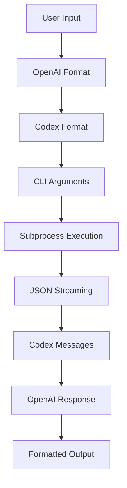

# Message Flow

Detailed explanation of how messages flow through the `claif_cod` system from user input to final output.

## Overview

The message flow in `claif_cod` involves multiple transformations as data moves through different layers of abstraction:



## Input Processing

### 1. User Input Normalization

```python
def normalize_user_input(messages, **kwargs):
    """Normalize various input formats to standard structure."""
    
    # Handle string prompts
    if isinstance(messages, str):
        messages = [{"role": "user", "content": messages}]
    
    # Validate message structure
    for message in messages:
        if not isinstance(message, dict):
            raise ValueError("Messages must be dictionaries")
        
        if "role" not in message or "content" not in message:
            raise ValueError("Messages must have 'role' and 'content'")
    
    # Ensure system message if needed
    if not any(msg["role"] == "system" for msg in messages):
        if "system_prompt" in kwargs:
            messages.insert(0, {
                "role": "system", 
                "content": kwargs["system_prompt"]
            })
    
    return messages
```

### 2. Parameter Validation

```python
class ParameterValidator:
    """Validates and normalizes request parameters."""
    
    VALID_MODELS = {"o4-mini", "o4", "o4-preview", "o3.5"}
    VALID_ROLES = {"system", "user", "assistant"}
    
    def validate_request(self, messages, **kwargs):
        """Comprehensive parameter validation."""
        
        # Model validation
        model = kwargs.get("model", "o4-mini")
        if model not in self.VALID_MODELS:
            raise ValueError(f"Invalid model: {model}")
        
        # Temperature validation
        temperature = kwargs.get("temperature", 0.2)
        if not 0 <= temperature <= 2:
            raise ValueError("Temperature must be between 0 and 2")
        
        # Token validation
        max_tokens = kwargs.get("max_tokens", 1000)
        if max_tokens < 1 or max_tokens > 4000:
            raise ValueError("max_tokens must be between 1 and 4000")
        
        # Message validation
        for i, message in enumerate(messages):
            if message["role"] not in self.VALID_ROLES:
                raise ValueError(f"Invalid role in message {i}: {message['role']}")
            
            if not message["content"].strip():
                raise ValueError(f"Empty content in message {i}")
        
        return True
```

## Format Conversion

### 1. OpenAI to Codex Format

```python
class FormatConverter:
    """Converts between OpenAI and Codex message formats."""
    
    def openai_to_codex(self, messages, **kwargs):
        """Convert OpenAI chat format to Codex CLI format."""
        
        # Extract system prompt
        system_prompt = None
        user_messages = []
        
        for message in messages:
            if message["role"] == "system":
                system_prompt = message["content"]
            elif message["role"] == "user":
                user_messages.append(message["content"])
            elif message["role"] == "assistant":
                # For multi-turn, append to context
                user_messages.append(f"Assistant: {message['content']}")
        
        # Build Codex options
        codex_options = CodexOptions(
            model=self._map_model(kwargs.get("model", "o4-mini")),
            temperature=kwargs.get("temperature", 0.2),
            max_tokens=kwargs.get("max_tokens", 1000),
            system_prompt=system_prompt,
            working_dir=kwargs.get("working_dir"),
            sandbox_mode=kwargs.get("sandbox_mode", "workspace-write"),
            approval_policy=kwargs.get("approval_policy", "on-failure")
        )
        
        # Combine user messages
        prompt = "\n\n".join(user_messages)
        
        return prompt, codex_options
    
    def _map_model(self, openai_model):
        """Map OpenAI model names to Codex equivalents."""
        mapping = {
            "gpt-4o": "o4",
            "gpt-4o-mini": "o4-mini", 
            "gpt-4o-preview": "o4-preview",
            "o1-preview": "o4-preview",
            "gpt-3.5-turbo": "o3.5"
        }
        return mapping.get(openai_model, openai_model)
```

### 2. Command Line Argument Construction

```python
class CommandBuilder:
    """Builds CLI command arguments from Codex options."""
    
    def build_command(self, cli_path, prompt, options):
        """Build complete command line arguments."""
        
        cmd = [cli_path, "exec"]
        
        # Add model
        if options.model:
            cmd.extend(["--model", options.model])
        
        # Add temperature
        if options.temperature is not None:
            cmd.extend(["--temperature", str(options.temperature)])
        
        # Add max tokens
        if options.max_tokens:
            cmd.extend(["--max-tokens", str(options.max_tokens)])
        
        # Add working directory
        if options.working_dir:
            cmd.extend(["--working-dir", str(options.working_dir)])
        
        # Add sandbox mode
        if options.sandbox_mode:
            cmd.extend(["--sandbox", options.sandbox_mode])
        
        # Add approval policy
        if options.approval_policy:
            cmd.extend(["--approval", options.approval_policy])
        
        # Add system prompt
        if options.system_prompt:
            cmd.extend(["--system", options.system_prompt])
        
        # Add JSON output flag
        cmd.append("--json")
        
        # Add prompt as final argument
        cmd.append(prompt)
        
        return cmd
```

## Subprocess Execution

### 1. Process Management

```python
class ProcessManager:
    """Manages subprocess lifecycle and communication."""
    
    async def execute_command(self, cmd, timeout=None):
        """Execute command with proper lifecycle management."""
        
        try:
            # Start subprocess
            process = await anyio.open_process(
                cmd,
                stdout=subprocess.PIPE,
                stderr=subprocess.PIPE,
                stdin=subprocess.PIPE
            )
            
            # Set up timeout
            with anyio.move_on_after(timeout) if timeout else nullcontext():
                async with process:
                    # Stream output
                    async for line in self._stream_output(process.stdout):
                        yield line
                    
                    # Wait for completion
                    await process.wait()
                    
                    # Check exit code
                    if process.returncode != 0:
                        stderr = await process.stderr.read()
                        raise ProcessError(f"CLI failed: {stderr.decode()}")
                        
        except anyio.get_cancelled_exc_class():
            # Handle timeout
            if process:
                process.terminate()
                await process.wait()
            raise TimeoutError("Command timed out")
    
    async def _stream_output(self, stdout):
        """Stream stdout line by line."""
        buffer = b""
        
        async for chunk in stdout:
            buffer += chunk
            
            # Process complete lines
            while b"\n" in buffer:
                line, buffer = buffer.split(b"\n", 1)
                if line.strip():
                    yield line.decode("utf-8")
        
        # Handle remaining data
        if buffer.strip():
            yield buffer.decode("utf-8")
```

### 2. Environment Management

```python
class EnvironmentManager:
    """Manages environment variables for subprocess."""
    
    def get_safe_environment(self):
        """Create safe environment for subprocess."""
        
        # Start with minimal environment
        env = {
            "PATH": os.environ.get("PATH", ""),
            "HOME": os.environ.get("HOME", ""),
            "USER": os.environ.get("USER", ""),
        }
        
        # Add OpenAI API key
        if "OPENAI_API_KEY" in os.environ:
            env["OPENAI_API_KEY"] = os.environ["OPENAI_API_KEY"]
        
        # Add Codex-specific variables
        codex_vars = [
            "CODEX_CLI_PATH",
            "CODEX_DEFAULT_MODEL", 
            "CODEX_ACTION_MODE",
            "CODEX_TIMEOUT"
        ]
        
        for var in codex_vars:
            if var in os.environ:
                env[var] = os.environ[var]
        
        return env
```

## Response Processing

### 1. JSON Stream Parsing

```python
class StreamParser:
    """Parses streaming JSON responses from Codex CLI."""
    
    def __init__(self):
        self.buffer = ""
        self.message_queue = []
    
    def parse_line(self, line):
        """Parse a single line of output."""
        
        # Add to buffer
        self.buffer += line
        
        # Try to parse complete JSON objects
        while self.buffer:
            try:
                # Find JSON object boundaries
                start = self.buffer.find("{")
                if start == -1:
                    break
                
                # Try to parse from start
                decoder = json.JSONDecoder()
                obj, end_idx = decoder.raw_decode(self.buffer, start)
                
                # Successfully parsed object
                self.message_queue.append(obj)
                self.buffer = self.buffer[start + end_idx:]
                
            except json.JSONDecodeError:
                # Not enough data, wait for more
                break
        
        # Return any complete messages
        messages = self.message_queue[:]
        self.message_queue.clear()
        return messages
    
    def parse_message(self, json_obj):
        """Convert JSON object to CodexMessage."""
        
        message_type = json_obj.get("type", "content")
        
        # Parse content blocks
        content_blocks = []
        if "content" in json_obj:
            for block_data in json_obj["content"]:
                block = self._parse_content_block(block_data)
                if block:
                    content_blocks.append(block)
        
        # Create message
        return CodexMessage(
            message_type=message_type,
            content=content_blocks,
            metadata=json_obj.get("metadata", {})
        )
    
    def _parse_content_block(self, block_data):
        """Parse individual content block."""
        
        block_type = block_data.get("type", "text")
        
        if block_type == "text":
            return TextBlock(
                text=block_data.get("text", ""),
                language=block_data.get("language")
            )
        elif block_type == "code":
            return CodeBlock(
                code=block_data.get("code", ""),
                language=block_data.get("language", ""),
                file_path=block_data.get("file_path")
            )
        elif block_type == "error":
            return ErrorBlock(
                error=block_data.get("error", ""),
                error_type=block_data.get("error_type", "unknown")
            )
        else:
            return TextBlock(text=str(block_data))
```

### 2. Message Aggregation

```python
class MessageAggregator:
    """Aggregates streaming messages into complete responses."""
    
    def __init__(self):
        self.current_message = None
        self.complete_messages = []
    
    def add_message(self, message):
        """Add a message to the aggregator."""
        
        if message.message_type == "start":
            self.current_message = {
                "content": [],
                "metadata": message.metadata or {}
            }
        
        elif message.message_type == "content":
            if self.current_message:
                self.current_message["content"].extend(message.content)
        
        elif message.message_type == "end":
            if self.current_message:
                # Create final message
                final_message = CodexMessage(
                    message_type="complete",
                    content=self.current_message["content"],
                    metadata=self.current_message["metadata"]
                )
                self.complete_messages.append(final_message)
                self.current_message = None
        
        elif message.message_type == "error":
            # Handle error messages
            error_message = CodexMessage(
                message_type="error", 
                content=message.content,
                metadata=message.metadata
            )
            self.complete_messages.append(error_message)
    
    def get_complete_messages(self):
        """Get all complete messages."""
        messages = self.complete_messages[:]
        self.complete_messages.clear()
        return messages
```

## Output Generation

### 1. Codex to OpenAI Conversion

```python
class ResponseConverter:
    """Converts Codex responses to OpenAI format."""
    
    def codex_to_openai(self, codex_message, **kwargs):
        """Convert CodexMessage to OpenAI ChatCompletion."""
        
        # Extract content text
        content_text = ""
        for block in codex_message.content:
            if isinstance(block, (TextBlock, CodeBlock)):
                content_text += str(block)
            elif isinstance(block, ErrorBlock):
                # Handle errors appropriately
                raise APIError(block.error)
        
        # Create OpenAI response structure
        choice = Choice(
            index=0,
            message=ChatMessage(
                role="assistant",
                content=content_text
            ),
            finish_reason=self._determine_finish_reason(codex_message)
        )
        
        # Calculate usage if available
        usage = None
        if "usage" in codex_message.metadata:
            usage_data = codex_message.metadata["usage"]
            usage = Usage(
                prompt_tokens=usage_data.get("prompt_tokens", 0),
                completion_tokens=usage_data.get("completion_tokens", 0),
                total_tokens=usage_data.get("total_tokens", 0)
            )
        
        # Create completion object
        completion = ChatCompletion(
            id=self._generate_id(),
            object="chat.completion",
            created=int(time.time()),
            model=kwargs.get("model", "o4-mini"),
            choices=[choice],
            usage=usage
        )
        
        return completion
    
    def _determine_finish_reason(self, message):
        """Determine finish reason from message."""
        if message.message_type == "error":
            return "error"
        elif any(isinstance(block, ErrorBlock) for block in message.content):
            return "error"
        elif "max_tokens" in message.metadata:
            return "length"
        else:
            return "stop"
```

### 2. Streaming Response Generation

```python
class StreamingConverter:
    """Converts Codex streaming to OpenAI streaming format."""
    
    def __init__(self):
        self.chunk_id = 0
    
    def create_chunk(self, content_delta, **kwargs):
        """Create OpenAI-compatible streaming chunk."""
        
        self.chunk_id += 1
        
        delta = ChoiceDelta(
            role="assistant" if self.chunk_id == 1 else None,
            content=content_delta
        )
        
        choice = ChoiceDelta(
            index=0,
            delta=delta,
            finish_reason=None
        )
        
        chunk = ChatCompletionChunk(
            id=self._generate_chunk_id(),
            object="chat.completion.chunk",
            created=int(time.time()),
            model=kwargs.get("model", "o4-mini"),
            choices=[choice]
        )
        
        return chunk
    
    def create_final_chunk(self, **kwargs):
        """Create final chunk with finish reason."""
        
        choice = ChoiceDelta(
            index=0,
            delta=ChoiceDelta(),
            finish_reason="stop"
        )
        
        chunk = ChatCompletionChunk(
            id=self._generate_chunk_id(),
            object="chat.completion.chunk", 
            created=int(time.time()),
            model=kwargs.get("model", "o4-mini"),
            choices=[choice]
        )
        
        return chunk
```

## Error Handling

### 1. Error Classification

```python
class ErrorClassifier:
    """Classifies and converts errors to OpenAI format."""
    
    ERROR_MAPPING = {
        "cli_not_found": APIConnectionError,
        "invalid_model": APIError,
        "rate_limited": RateLimitError,
        "timeout": APITimeoutError,
        "auth_failed": APIError,
        "invalid_request": APIError
    }
    
    def classify_error(self, error_data):
        """Classify error and return appropriate exception."""
        
        error_type = error_data.get("type", "unknown")
        error_message = error_data.get("message", "Unknown error")
        
        # Map to OpenAI exception type
        exception_class = self.ERROR_MAPPING.get(
            error_type, 
            OpenAIError
        )
        
        # Create exception with appropriate details
        if exception_class == APIError:
            return exception_class(
                message=error_message,
                status_code=error_data.get("status_code", 500)
            )
        else:
            return exception_class(error_message)
```

### 2. Recovery Strategies

```python
class ErrorRecovery:
    """Implements error recovery strategies."""
    
    def __init__(self, max_retries=3):
        self.max_retries = max_retries
    
    async def with_recovery(self, operation, *args, **kwargs):
        """Execute operation with error recovery."""
        
        last_error = None
        
        for attempt in range(self.max_retries):
            try:
                return await operation(*args, **kwargs)
                
            except (APITimeoutError, APIConnectionError) as e:
                last_error = e
                if attempt < self.max_retries - 1:
                    # Exponential backoff
                    delay = 2 ** attempt
                    await asyncio.sleep(delay)
                    continue
                else:
                    raise
            
            except RateLimitError as e:
                last_error = e
                if attempt < self.max_retries - 1:
                    # Wait longer for rate limits
                    delay = 60 * (attempt + 1)
                    await asyncio.sleep(delay)
                    continue
                else:
                    raise
            
            except APIError as e:
                # Don't retry client errors
                raise
        
        # If we get here, all retries failed
        raise last_error
```

## Complete Flow Example

Here's how a complete request flows through the system:

```python
async def complete_flow_example():
    """Example of complete message flow."""
    
    # 1. User input
    user_messages = [
        {"role": "system", "content": "You are a helpful assistant"},
        {"role": "user", "content": "Write a Python function"}
    ]
    
    # 2. Input normalization
    validator = ParameterValidator()
    validator.validate_request(user_messages, model="o4-mini")
    
    # 3. Format conversion
    converter = FormatConverter()
    prompt, codex_options = converter.openai_to_codex(
        user_messages, 
        model="o4-mini",
        temperature=0.2
    )
    
    # 4. Command building
    builder = CommandBuilder()
    cmd = builder.build_command("/usr/local/bin/codex", prompt, codex_options)
    
    # 5. Subprocess execution
    manager = ProcessManager()
    parser = StreamParser()
    aggregator = MessageAggregator()
    
    async for line in manager.execute_command(cmd, timeout=300):
        # 6. JSON parsing
        messages = parser.parse_line(line)
        
        for json_obj in messages:
            codex_message = parser.parse_message(json_obj)
            aggregator.add_message(codex_message)
    
    # 7. Response conversion
    response_converter = ResponseConverter()
    complete_messages = aggregator.get_complete_messages()
    
    for codex_message in complete_messages:
        openai_response = response_converter.codex_to_openai(
            codex_message,
            model="o4-mini"
        )
        
        # 8. Final output
        return openai_response
```

---

*Next: Check out the complete [API Reference](api-reference.md) for detailed documentation of all classes and methods.*